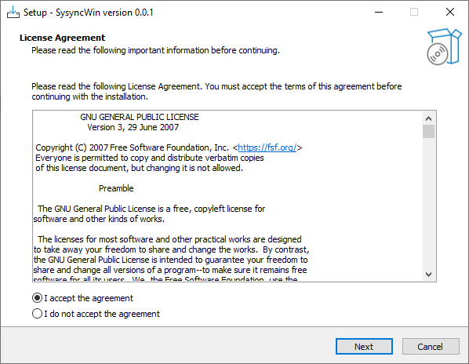
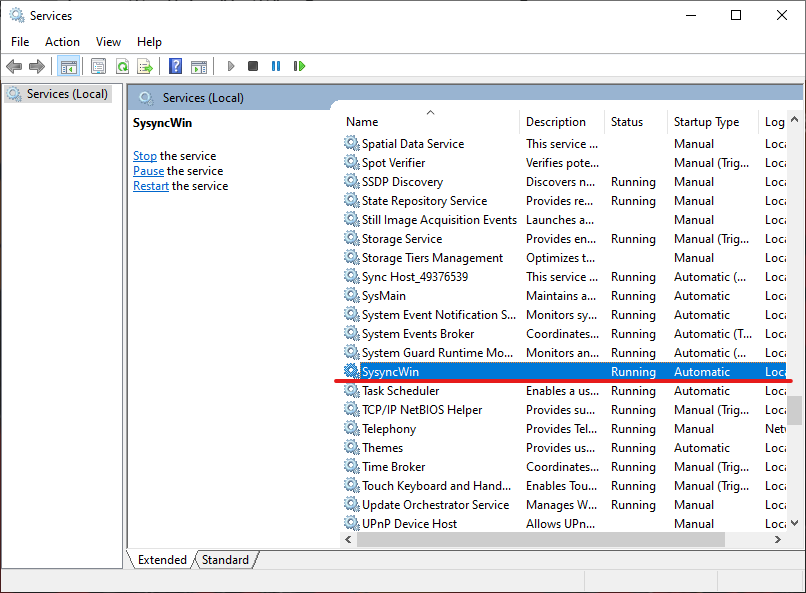

# Syncsys-WinClient

## What is it

This is the Windows client of the Syncsys project. You can find its packing scripts [here](https://github.com/PelerYuan/Sysync-WinClient-Installer), and the server repository [here](https://github.com/Tommy-Zhang3759/Sysync-ConfigServer). 

Now, the whole software is made in Python, **without any usage of third party library**. We are now considering to rebuild it by other programming languages, the first option for us is Go.

To get a basic overview of the features, please go *Overview*.

To get to know the usage of this software, please go *How to use*.

To get to know the detailed information of how it works, please go *How it works*.

Now, the software is still being developed, and does not have many features. For the developing scheme and work progress, please see *TODO*.

The software works by responding to API requests that the server sent. For the whole API list, please see *API List*.

This project is developed by two senior high school students, with the great help and support from their computer science teacher. For more information, please see *Authors, License, Acknowledgements*.

## Overview

### Basic functions

- Find and connect to the server according to the local settings.

- Batch modify the Windows registry
- Batch modify Windows network configuration
- Listening to the broadcast and automatically get static IP and host names when the server address that is saved locally is unavailable.
- Separate files/folders (NFS/SMB)

### Advanced features

- Remote control (VNC)
- Screen monitoring

## How to use

### Installation

You can simply download the release [here](https://github.com/PelerYuan/Sysync-WinClient-Installer/releases). If you want to build the installer by yourself, please see [here](https://github.com/PelerYuan/Sysync-WinClient-Installer).

After you get the installer, the only thing you need to do is just running it, with administrative permission. Then, the software will be installed automatically and start to run as a Windows Service.

The screen shot of the installer:

 

The screen shot of the service manager, showing that the service has been started:

### Uninstallation

***Before install the software again, uninstalling is always necessary***

The software provides an uninstaller. If you have installed the software properly, you can find the uninstaller in `C:\SysyncWin`.

Run the uninstaller with administrative permission, the files and service will be removed.

### Development testing

## How it works

When installing the software, the installer will regist the software to be a Windows Service, so it will keep running in the background and has a very high permission, thus enable it to modify the system settings.

While running, the software listens to messages from the server, and respond to it. We want to keep the client simple, smart. Therefor, we do not provide any user interface, so there is nothing you could do with the software on Windows. All the configurations will be done or change by the commands from the server.

This is just an introduction, *DevDoc* provides more technological information.

## TODO

- [ ] fully support all API features
- [ ] rebuild by other programming languages

## API List

### *run_command*

- protocol: UDP
- args: *string* *command* shell language script would like to run;

### *update_host_name*

- protocol: UDP
- args: *string* *host_ip* target server that will response host name checking request; *int* *host_port* the target port on the target server;
- description: The client will send a request, which includes *f_name* equals to *host_name_req* to the target server on target port to get the host name identified by the MAC address.

### *host_name_offer*

- protocol: UDP
- args: *string* *host_name* the client will set local NetBIOS name as this value;
- description: By modifying regestory, changing NetBIOS name

### *net_ip_dhcp*

- protocol: UDP
- args: *string* *interface_name* target local network interface name *bool* *dhcp_dns=True* set *False* to disable set DNS server included in DHCP potion;
- description:

### *net_static_ip*

- protocol: UDP args: *string* *interface_name* target local network interface name; *string* *ip_address* IP address to set; *string* *subnet_mask* subnet mask to set; *string* *gateway* the IP address of net gateway; *string* *dns* the IP address of DNS server to set;
- description: This function is used to set address and other necessities manually.

### *net_dns_static*

- protocol: UDP
- args: *string* *interface_name* The network interface to configure; *string* *dns*: The DNS server IP address. *bool* *dhcp_dns=True* Determines if DNS should be assigned via DHCP;
- description: Sets a static DNS server for the specified network interface, with optional DHCP-based DNS configuration.

### *set_server_info*

- protocol: UDP
- args: *string* *server_ip* The IP address of the server to be set in the configuration file; *int* *server_port*: The port of the server to be set in the configuration file.
- description: Updates the server's IP address and port in the client configuration file (SETTINGS_FILE).

## Authors, License, Acknowledgements

